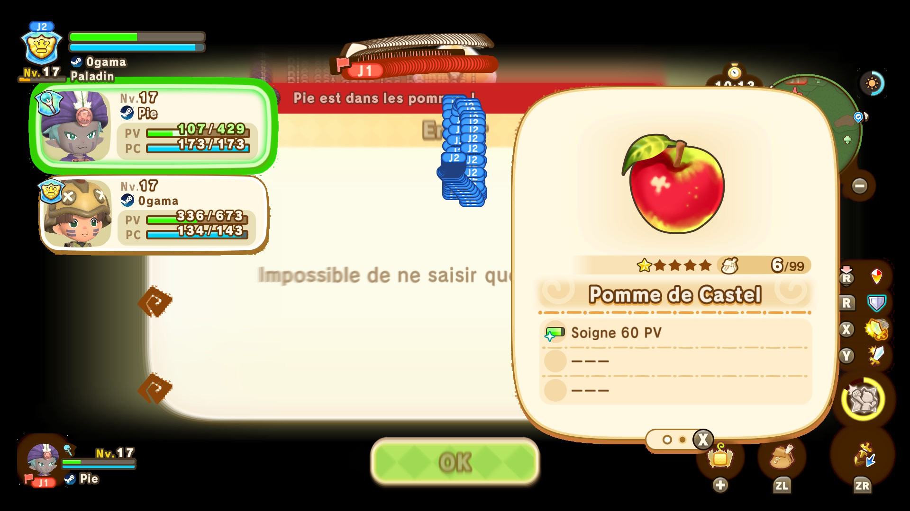

Some more, some less evident tech, glitches and knowledge from the early days of FLi.
(Discoverers are the people who talked about it on #speedrunning first)

# Tech
## Hunter Spin Dash
### Discovery
Vex
### Description
Using the Hunter life Y attack, you can go faster than with you mount.
### Media

## EXP Crystal Life Switch
### Discovery
Pie
### Description
After killing a high level boss, if they drop an EXP Crystal, you can switch lives and get the EXP to your new life instead, useful to get some early levels.

## EXP Buddy Life Switch?
(Theory)
### Discovery
Pie
### Description
While killing a high level boss with a buddy's Special Skill/a very long-animation attack, you might have time to undraw your weapon, switch lives and reap the rewards onto your new life.
Similar to [EXP Crystal Life Switch](#exp-crystal-life-switch)

## HP Potion Life Switch
### Discovery
Pie
### Description
When on low HP with a high Max HP life, you can switch lives to one that has low Max HP, gain HP, and switch back. Since the HP during the switch is based off of Max HP%, you can get extremely high levels of healing out of a simple HP potion.

## Master Fast Travel
### Discovery
Ogama75
### Description
From the Life menu, you can TP to your Masters. This TP doesn't have the Skelegon animation, and a really fast loading.
For example, TPing to the Paladin Master is way faster than TPing to the Guild Office.

## Portal Reload
### Discovery
Sushi
### Description
After getting a Ressource, you can use the Teleportation Gate to go in and out of Ginormosia very quickly, respawning every Ressource in the area.

## Farmer Time Skip
### Discovery
Sushi
### Description
After planting a crop, you can change your system's time and reload the area to make crops grow instantly. Going back in time doesn't undo progress on the crops.

## Mount Ledge Grab
### Discovery
Pie
### Description
You can sometimes use the higher jump height of the mount to skip a climbing step.
### Media

## Half Ledge Boost
### Discovery
Pie
### Description
You can get a boost while climbing over some half-ledges.
### Media

# Glitches
## Eat Menu Overloading?
(More testing needed, benefits unknown)
### Discovery
Ogama75
### Description
In multiplayer, if you die while eating an item in the Items menu, you get the overlay over the game, with a lot of visuals broken.
We are unsure whether this is purely visual or it can be used for more glitches.
### Media

## OOB Spots
### Lava Bath
#### Discovery
Pie
#### Description
From the very top of the highest pillar in the volcanic region of Ginormosia, jump to the right of the big skeleton in the lava. Getting back in bounds can be a bit of a pain, but you can climb up from the place with the teeth thingies and you'll get snapped back in bounds.
#### Media

## Half-Ledge Stuck
### Discovery
Pie
### Description
On some places with half-ledges, you might get stuck trying to get up.
### Media

# Info
## Life Quest Rank
### Discovery
Sushi
### Description
If you're a lower rank than a Life Quest you complete (eg. being Adept Miner and doing an Expert Miner Quest), you can only cash it in after ranking up to the right rank. This is different from the 3DS game where you could theoretically rank up your Life by doing a very high rank Quest.

## Mounting With Momentum
### Discovery
Pie
### Description
Mounting without any momentum locks you into an animation, whereas mounting while moving only slows you down a little.
### Media

